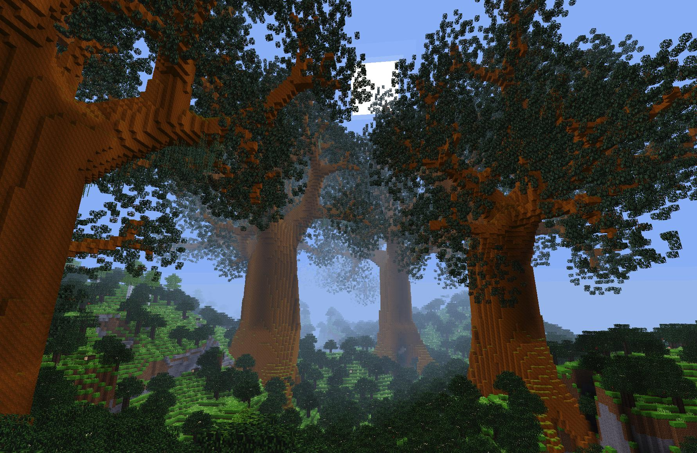

# Grunds - A Minetest biome with giant trees [EXPERIMENTAL]

This mod adds a "grunds" biome to mapgen, with giant grund trees. Inspired from
an old 8bits Apple ][ game named "Below the root".

**Don't use this mod on any server!** It is in a very experimental stage of development.

**Version**: Alpha

**Dependancies**: default

**License**: LGPL v2.1 (code) CC-BY-SA 3.0 (textures)

**See also**: [Minetest forum thread](https://forum.minetest.net/viewtopic.php?t=24539)

## Test it

To test Grunds:
  * create a new world
  * select *minetest_game* game
  * choose *v6*, *v7* or *valleys* map generator (not available on other mapgens)
  * enable *grunds* mod

To find a Grund biome to explore, type `/find_biome grunds`. This command will
show random coordinates in a grund biome. Use `/teleport` to go there.

A tree can be grown using command `/grow_grund`. The tree will start at the
ground level right under (or above) your position.
